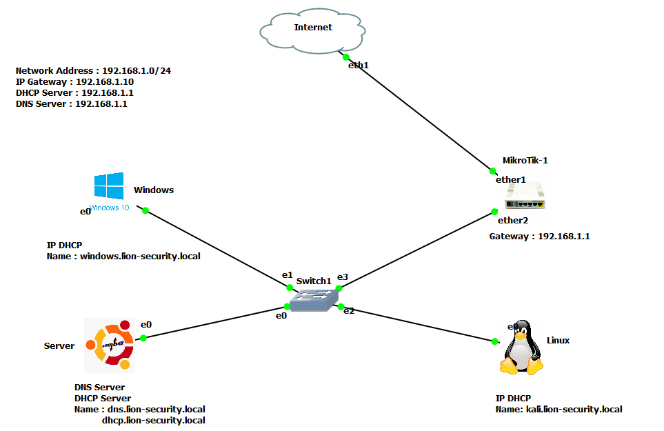
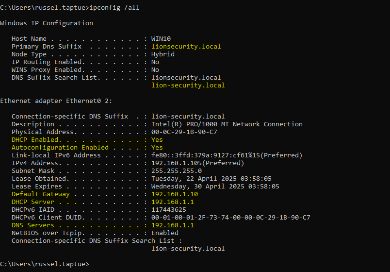
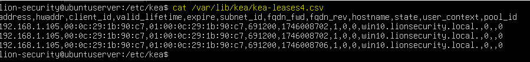

# Configuration d’un Serveur DHCP avec Kea DHCPv4 sur Ubuntu Server

Ce guide explique comment installer et configurer un serveur **Kea DHCPv4** développé par l’ISC sur une machine Ubuntu Server. Kea est une alternative moderne à `isc-dhcp-server`, plus performante et modulable.

---

## ✅ Prérequis

- Ubuntu Server (22.04 ou une version plus recente)
- Accès sudo
- Connexion internet pour installer les paquets

---

## 🛠️ Installation de Kea DHCP Server

1. Mettre à jour le système :

```bash
sudo apt update && sudo apt upgrade -y
```

2. Installer Kea :

```bash
sudo apt install kea-dhcp4-server -y
```

---

## 🧭 Architecture du réseau

Le schéma ci-dessous illustre l'architecture du réseau utilisé pour ce projet :



- **Serveur Ubuntu** : héberge le service Kea DHCP
- **Clients** : PC Windows et Linux reçoivent dynamiquement une adresse IP
- **Un routeur Mikrotik** : jout le role de passerelle vers internet
- **Réseau local** : 192.168.1.0/24

---

## 📁 Fichiers importants

- **Fichier de configuration principal** :  
  `/etc/kea/kea-dhcp4.conf`
- **Fichier des baux DHCP (leases)** :  
  `/var/lib/kea/kea-leases4.csv`
- **Fichier de log** :  
  `/var/log/syslog` ou via `journalctl`


Vous avez un exemple fonctionnel de fichier kea-dhcp4.conf dans ce depot
---

## ⚙️ Étapes de configuration

1. Modifier le fichier `/etc/kea/kea-dhcp4.conf` pour définir :
   - L’interface réseau utilisée
   - La plage d’adresses IP
   - La passerelle par défaut
   - Le DNS

2. Valider la syntaxe :

```bash
kea-dhcp4 -t -c /etc/kea/kea-dhcp4.conf
```

3. Redémarrer le service Kea :

```bash
sudo systemctl restart kea-dhcp4-server
```

4. Vérifier que le service est actif :

```bash
sudo systemctl status kea-dhcp4-server
```

---

## 🧪 Test de fonctionnement

### 🔍 Côté client (Windows)

Exécuter la commande suivante :

```cmd
ipconfig /all
```

#### ✅ Exemple de capture



---

### 🗃️ Base de données des adresses IP attribuées

Kea enregistre les baux DHCP dans un fichier CSV par défaut :

- Fichier : `/var/lib/kea/kea-leases4.csv`

Vous pouvez y observer les adresses attribuées, les durées, les MAC, etc.

#### 📷 Exemple :



---

## 📌 Remarques

- Kea n’écoute que sur les interfaces activées dans sa config.
- Assurez-vous qu’aucun autre serveur DHCP ne fonctionne sur le réseau.
- Le fichier `kea-leases4.csv` peut être remplacé par une base de données (MySQL/PostgreSQL) dans une configuration avancée, nous vous laissons personnaliser votre serveur.

---

## 🔗 Ressources utiles

- [Documentation officielle Kea DHCP](https://kea.readthedocs.io/)

---
